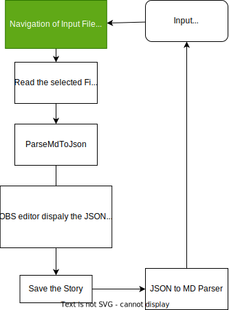
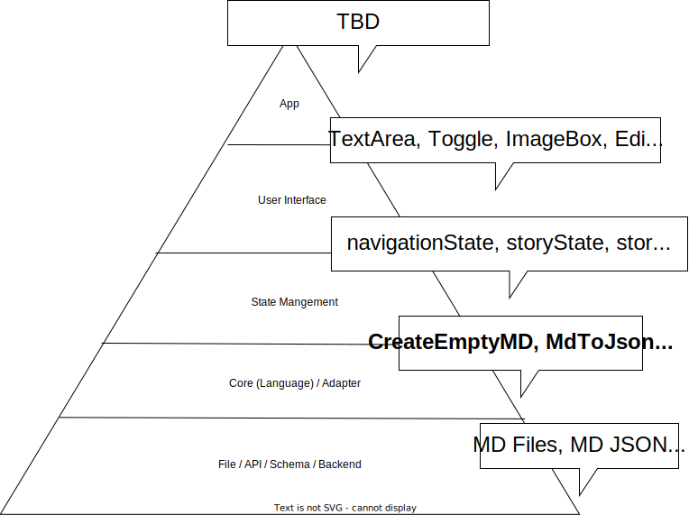

# Chris OBS

## Overview
This library provides user interfaces, state-managing custom hooks, and core functions for displaying and editing Open Bible Stories (OBS).

### Tech Stack
- ReactJS for UI & State Management
- Pure JS for core funcitons
- Vite for running a sandbox for dev mode
- Styleguidist for demoing our library

### Links
[Styleguide](chris-obs.netlify.app)

### User Interfaces
- EditorPanel: Displays and edits the content of one OBS story

### Custom Hooks
- useStory: Handles the state of a single OBS story and provides actions for a story

### Core Functions
- mdToJson: Parses OBS markdown (md) files into a Story JSON object 

## How to Install Library from NPM
In the application that you want to use `chris_obs` within:
```bash
pnpm add chris_obs
```

## How to Run the Application

### Note on Package Manager
In our application we used pnpm to manage our dependencies. Use whichever package manager you are most comfortable with (npm, yarn, etc.)
### Run in Development Mode
We are using vite to run our application from the **main.js** file. This is just to provide a quick sandbox where we can demo our library.

1. Clone the Repository 
    ```bash
    git clone https://github.com/
    ```
2. Install Dependencies in root directory
   ```bash
   pnpm install
   ```
3. Run the `dev` script from `package.json` to start vite
   ```bash
   pnpm run dev
   ```

### Run in Styleguide
We are using Styleguidist to provide examples of our user interfaces within our library. To run the stylguidist locally...

1. Clone the Repository 
    ```bash
    git clone https://github.com/
    ```
2. Install Dependencies in root directory
   ```bash
   pnpm install
   ```
3. Run the `styleguide` script from the `package.json` to see styleguide locally:
   ```bash
   pnpm run styleguide
   ```

<!-- ## Other RCLs we Use (NONE) -->


## Design

### Diagrams
#### Flow Diagram


#### Layers Diagram



#### Architecture Diagram

<!-- TODO -->
